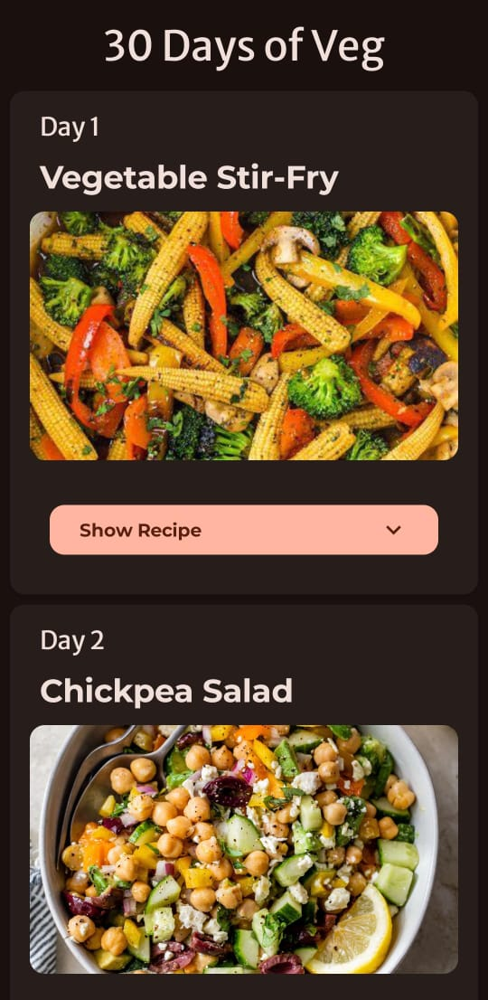
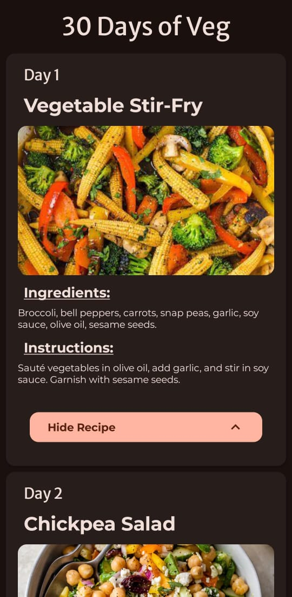

# 30 Days of Veg

A mini Android application built with Jetpack Compose, showcasing a 30-day vegetarian meal plan.

## Features

- Lazy Column implementation for efficient scrolling
- Attractive Card-based UI design
- Smooth Spring Animation effects
- Custom Theme implementation for consistent branding
- Data modeling using Kotlin's Object and Data classes

## Technologies Used

- Android Jetpack Compose
- Kotlin
- Spring Animation

## Project Overview

"30 Days Of Veg" is a demonstration of Android Jetpack Compose capabilities in building responsive, visually appealing, and efficient user interfaces. This project also explores the use of custom themes to maintain a consistent look and feel throughout the application.

## Screenshot
-------------------------

-------------------------

## Getting Started

To run the project, follow these steps:
1. Clone the repository.
2. Open the project in Android Studio.
3. Build and run the application on an emulator or physical device.

## Code Structure

The project consists of the following main components:
- `data:` Contains data models for meals using Kotlin's Object and Data classes.
- `ui:` Houses the Jetpack Compose UI components, including Lazy Column and Card implementations.
- `animation:` Demonstrates Spring Animation effects.
- `theme:` Defines the custom theme used throughout the application.

## Learning Outcomes

Through this project, I gained hands-on experience with:
- Implementing Jetpack Compose UI components
- Creating custom themes in Android
- Using Spring Animation for smooth UI interactions
- Modeling data with Kotlin's Object and Data classes.

## Acknowledgments
---------------
Special thanks to the Android Jetpack Compose and Kotlin communities for providing valuable resources and documentation.